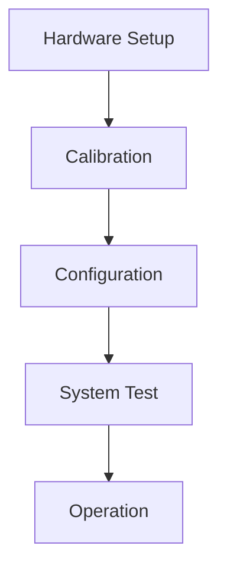
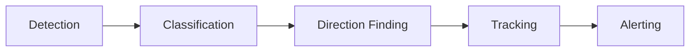
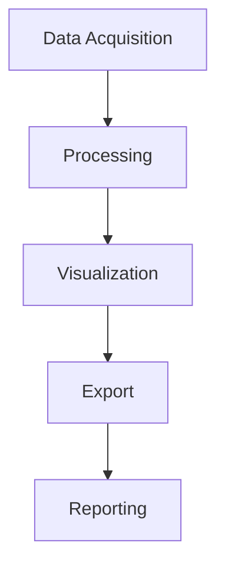
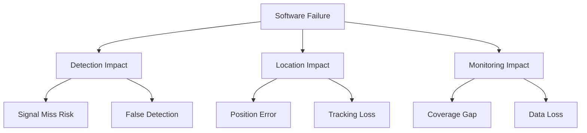

# Product Context

## Project Purpose

### Problem Statement
The Direction Finding (DF) system addresses the need for accurate, real-time signal source localization in complex RF environments. Traditional systems often struggle with:
- Limited processing speed for wide bandwidth signals
- Poor accuracy in multipath environments
- High false alarm rates
- Complex setup and operation
- Limited integration capabilities

### Solution Overview
Our DF system combines advanced hardware with GPU-accelerated processing to provide:
- Real-time signal detection and localization
- High accuracy TDOA measurements
- Automated signal classification
- User-friendly operation
- Flexible integration options

## User Experience Goals

### 1. Operational Simplicity

- Minimal setup time
- Intuitive configuration
- Clear status indicators
- Automated calibration
- User-friendly interface

### 2. Information Clarity
- Real-time status updates
- Clear visualization of results
- Meaningful error messages
- Comprehensive logging
- Easy data export

### 3. Operational Reliability
- Continuous operation capability
- Automatic error recovery
- System health monitoring
- Data integrity protection
- Regular performance reports

## Key Features

### 1. Signal Detection
- Wide bandwidth coverage
- High probability of intercept
- Low false alarm rate
- Automatic threshold adaptation
- Signal classification

### 2. Direction Finding
- High accuracy TDOA
- Multipath mitigation
- Error estimation
- Track formation
- Location confidence metrics

### 3. System Integration
- Network operation
- Data export formats
- External triggering
- Remote control
- API access

## User Workflows

### 1. System Setup

### 2. Normal Operation

### 3. Data Analysis

## Success Metrics

### 1. Performance Metrics
- Detection probability > 99%
- False alarm rate < 1%
- Location accuracy < 100m
- Processing latency < 100ms
- System uptime > 99.9%

### 2. Usability Metrics
- Setup time < 30 minutes
- Training time < 4 hours
- Error recovery < 5 minutes
- User satisfaction > 90%
- Support calls < 2/month

### 3. Integration Metrics
- API response time < 50ms
- Data export time < 1s
- Network bandwidth < 100Mbps
- Storage efficiency > 90%
- Update success rate > 99%

## Future Enhancements

### 1. Planned Features
- Machine learning classification
- Advanced multipath handling
- Cloud integration
- Mobile operation
- Automated optimization

### 2. Potential Improvements
- Enhanced visualization
- Additional signal types
- Expanded frequency range
- Reduced power consumption
- Smaller form factor

### 3. Integration Opportunities
- Additional data formats
- More analysis tools
- Third-party integrations
- Remote operation
- Automated reporting

## Certification Context

### DO-178C Compliance Overview
The TDOA Direction Finder system requires DO-178C Level C certification due to its critical role in signal intelligence and spectrum monitoring applications. This compliance level is appropriate for systems where software failure could result in major but non-catastrophic conditions.

### Safety Impact Analysis

### Certification Requirements Impact

1. **Operational Requirements**
   - Real-time signal detection reliability
   - Location accuracy assurance
   - System availability requirements
   - Performance monitoring
   - Error handling requirements

2. **Safety Requirements**
   - Failure condition handling
   - Data integrity assurance
   - System state monitoring
   - Recovery procedures
   - Fault isolation

3. **Security Requirements**
   - Access control implementation
   - Data protection measures
   - Secure communication
   - Audit trail maintenance
   - Intrusion detection

### Compliance Integration

1. **Development Process**
   - Requirements management
   - Design documentation
   - Code implementation
   - Testing procedures
   - Review processes

2. **Verification Process**
   - Requirements verification
   - Design verification
   - Code verification
   - Test verification
   - System verification

3. **Quality Assurance**
   - Process compliance
   - Product quality
   - Documentation quality
   - Review effectiveness
   - Problem resolution

### Certification Deliverables

1. **Planning Documents**
   - Software Development Plan
   - Software Verification Plan
   - Software Quality Assurance Plan
   - Software Configuration Management Plan
   - Tool Qualification Plan

2. **Development Artifacts**
   - Requirements Documentation
   - Design Documentation
   - Source Code
   - Test Cases
   - Review Records

3. **Verification Results**
   - Test Results
   - Analysis Reports
   - Review Reports
   - Coverage Reports
   - Problem Reports

### Quality Objectives

1. **Product Quality**
   - Reliability targets
   - Performance requirements
   - Safety objectives
   - Security goals
   - Maintainability requirements

2. **Process Quality**
   - Development standards
   - Verification procedures
   - Documentation requirements
   - Review processes
   - Problem handling

3. **Certification Quality**
   - Compliance objectives
   - Documentation completeness
   - Verification coverage
   - Tool qualification
   - Process adherence 