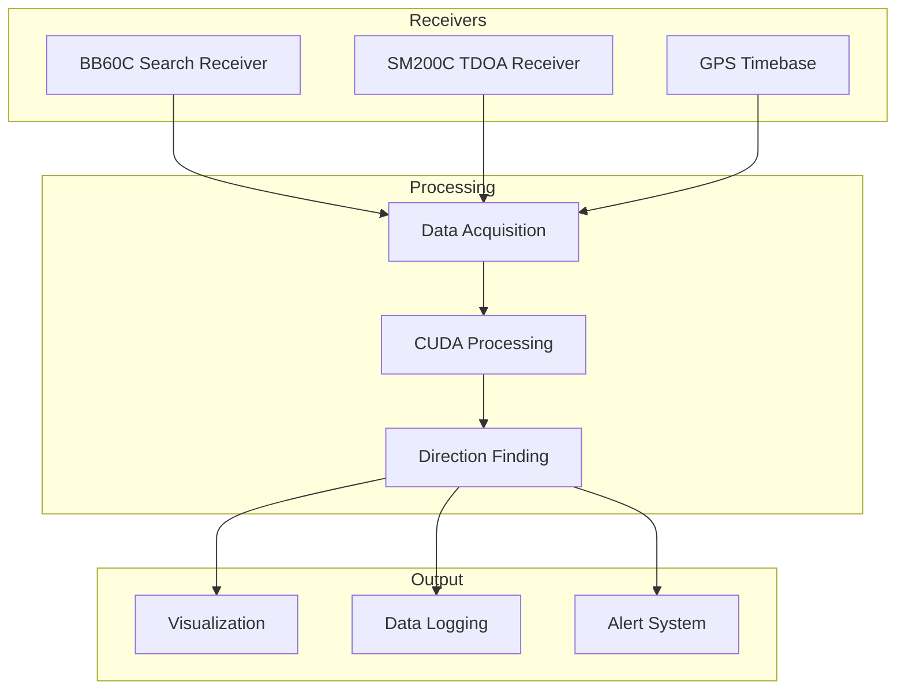

# System Patterns

## System Architecture

### High-Level Architecture


## Key Technical Decisions

### 1. Dual-Receiver Architecture
- Primary: SignalHound SM200C for TDOA measurements
- Secondary: SignalHound BB60C for search and detection
- Rationale: Optimal balance of cost and performance

### 2. CUDA Processing Pipeline
- GPU-accelerated signal processing
- Real-time FFT and correlation
- Parallel processing of multiple signals
- Memory management optimization

### 3. Time Synchronization
- GPS-disciplined timebase
- Nanosecond-level accuracy
- Phase coherent measurements
- Distributed timing system

## Design Patterns

### 1. Signal Processing Chain


### 2. Data Flow Architecture
- Producer-Consumer Pattern
- Ring Buffer Implementation
- Zero-Copy Data Transfer
- CUDA Streams for Overlap

### 3. Component Relationships
```mermaid
flowchart TD
    subgraph Hardware Layer
        RCV[Receivers]
        GPS[GPS]
        GPU[GPU]
    end

    subgraph Software Layer
        DRV[Device Drivers]
        DAQ[Data Acquisition]
        PROC[Signal Processing]
    end

    subgraph Application Layer
        GUI[User Interface]
        CTRL[System Control]
        LOG[Logging]
    end

    Hardware Layer --> Software Layer
    Software Layer --> Application Layer
```

## Implementation Patterns

### 1. Signal Detection
- Energy Detection
- Feature Extraction
- Threshold Adaptation
- False Alarm Management

### 2. TDOA Processing
- Cross-Correlation
- Peak Detection
- Phase Analysis
- Error Estimation

### 3. Direction Finding
- Geolocation Algorithm
- Error Ellipse Calculation
- Multi-signal Resolution
- Track Formation

## Error Handling

### 1. Hardware Failures
- Receiver Status Monitoring
- GPS Lock Detection
- Temperature Monitoring
- Automatic Recovery

### 2. Processing Errors
- Buffer Overflow Protection
- CUDA Error Handling
- Memory Management
- Performance Monitoring

### 3. System Recovery
- Automatic Restart
- State Recovery
- Data Preservation
- Error Logging

## Testing Patterns

### 1. Unit Testing
- Signal Processing Functions
- Algorithm Validation
- Performance Benchmarks
- Error Handling

### 2. System Testing
- End-to-End Validation
- Performance Verification
- Stability Testing
- Load Testing

### 3. Field Testing
- Accuracy Verification
- Range Testing
- Environmental Testing
- Interference Testing 