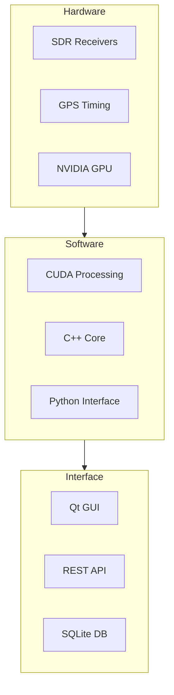
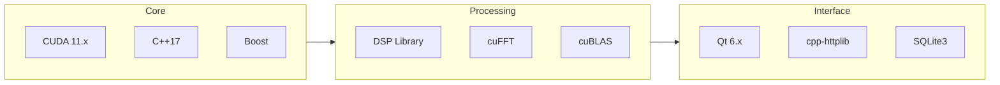
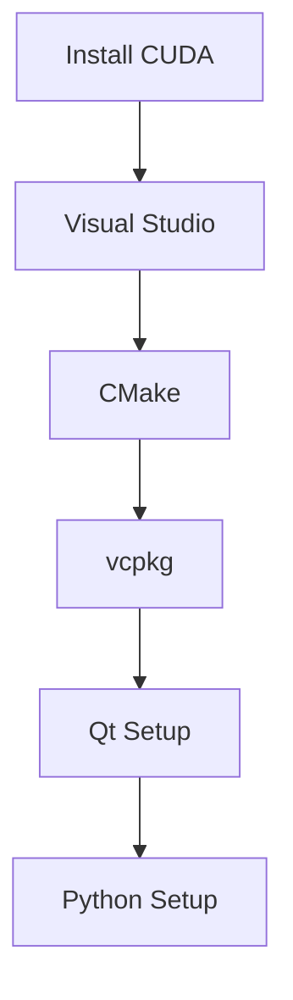
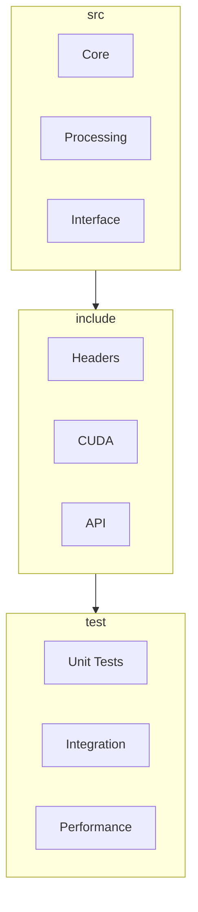
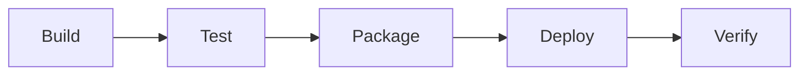

# Technical Context

## Technology Stack

### Core Technologies

### Development Environment
- Windows 10/11 with CUDA support
- Visual Studio 2019/2022
- Python 3.8+
- Qt Creator
- Git for version control

### Build System
- CMake 3.20+
- CUDA Toolkit 11.x
- vcpkg package manager
- Python pip requirements
- Qt build tools

## Dependencies

### Hardware Requirements
- NVIDIA GPU (Compute 7.0+)
- SDR receivers
- GPS timing source
- Network interface
- Storage system

### Software Dependencies

### External Libraries
- Boost 1.75+
- Qt 6.x
- cpp-httplib
- SQLite3
- pybind11
- numpy
- scipy

## Development Setup

### 1. Environment Setup

### 2. Build Configuration
- Debug and Release modes
- CUDA architecture targets
- Optimization settings
- Library linking
- Resource management

### 3. Development Tools
- Visual Studio Code
- CUDA Toolkit
- Qt Creator
- Git
- CMake GUI

## Technical Constraints

### 1. Performance Requirements
- Real-time processing
- Low latency
- High throughput
- Memory efficiency
- GPU utilization

### 2. Hardware Limitations
- GPU memory
- PCIe bandwidth
- Storage speed
- Network capacity
- Power consumption

### 3. Software Constraints
- CUDA compatibility
- Driver requirements
- OS compatibility
- Library versions
- API limitations

## Development Workflow

### 1. Code Organization

### 2. Build Process
1. Configure CMake
2. Generate build files
3. Compile CUDA kernels
4. Build C++ code
5. Link libraries
6. Package resources

### 3. Testing Strategy
- Unit testing
- Integration testing
- Performance testing
- System testing
- Regression testing

## Deployment

### 1. Release Process

### 2. Installation Requirements
- CUDA runtime
- Visual C++ runtime
- Qt runtime
- Python runtime
- Driver requirements

### 3. Update Management
- Version control
- Dependency updates
- Configuration updates
- Database migrations
- Runtime updates

## Monitoring and Maintenance

### 1. Performance Monitoring
- GPU utilization
- Memory usage
- Processing latency
- System throughput
- Error rates

### 2. System Health
- Hardware status
- Software status
- Resource usage
- Error logging
- Performance metrics

### 3. Maintenance Tasks
- Log rotation
- Database cleanup
- Cache management
- Configuration backup
- System updates

## DO-178C Compliance Context

### Development Environment
1. **Tool Chain Requirements**
   - All development tools must be qualified according to DO-330
   - Version control system with audit capabilities
   - Requirements management system with traceability
   - Static analysis tools with certification support
   - Test management system with coverage analysis

2. **Build Environment**
   - Reproducible build system
   - Build verification tools
   - Configuration management integration
   - Artifact management system
   - Release management tools

3. **Testing Environment**
   - Automated test framework
   - Coverage analysis tools
   - Test case management system
   - Requirements-based test tools
   - Integration test environment

### Tool Qualification
1. **Development Tools**
   - IDE qualification requirements
   - Compiler qualification
   - Static analysis tools
   - Design tools
   - Modeling tools

2. **Verification Tools**
   - Test automation framework
   - Coverage analysis tools
   - Review management tools
   - Problem tracking system
   - Requirements management tools

3. **Support Tools**
   - Configuration management system
   - Build automation tools
   - Documentation generators
   - Traceability tools
   - Metrics collection tools

### Technical Standards
1. **Coding Standards**
   - Language subset definition
   - Style guidelines
   - Documentation requirements
   - Review checklists
   - Static analysis rules

2. **Documentation Standards**
   - Requirements format
   - Design documentation
   - Test documentation
   - Review records
   - Configuration management records

3. **Process Standards**
   - Development workflow
   - Review procedures
   - Change management
   - Problem reporting
   - Quality assurance

### Verification Environment
1. **Testing Infrastructure**
   - Test execution framework
   - Test data management
   - Results collection
   - Coverage analysis
   - Performance testing

2. **Review Environment**
   - Code review tools
   - Document review system
   - Issue tracking
   - Resolution verification
   - Audit support

3. **Analysis Environment**
   - Static analysis tools
   - Dynamic analysis
   - Memory analysis
   - Performance analysis
   - Safety analysis

### Configuration Management
1. **Version Control**
   - Source code management
   - Document versioning
   - Baseline management
   - Release control
   - Change tracking

2. **Build Management**
   - Automated builds
   - Build verification
   - Artifact management
   - Release packaging
   - Distribution control

3. **Problem Tracking**
   - Issue management
   - Problem reporting
   - Resolution tracking
   - Impact analysis
   - Status monitoring

### Quality Assurance
1. **Process Monitoring**
   - Compliance verification
   - Process metrics
   - Quality indicators
   - Trend analysis
   - Improvement tracking

2. **Product Quality**
   - Quality metrics
   - Defect tracking
   - Performance monitoring
   - Reliability analysis
   - Safety verification

3. **Documentation**
   - Process documentation
   - Quality records
   - Audit reports
   - Review records
   - Compliance evidence 